<p align="center">
  
</p>

<h1 align="center">LST - Lucero Systems Template</h1>

<p align="center">
  <em>⚡ Rapidly scaffold production‑ready Clojure web apps with a professional, themed UI.</em>
</p>

<p align="center">
  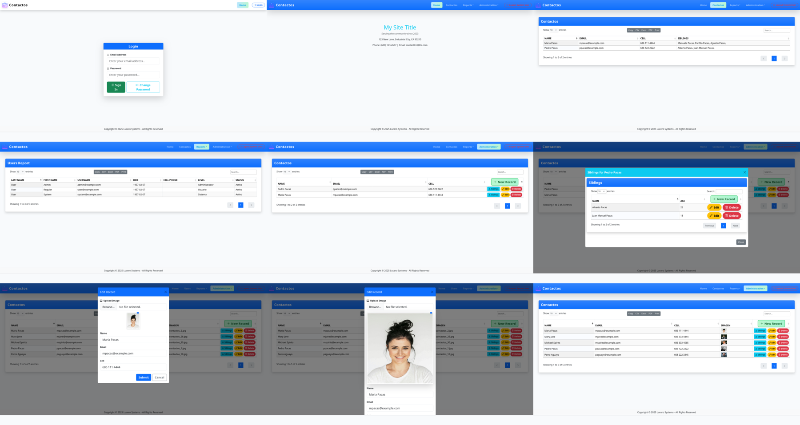
  <br/>
  <sub>A quick glimpse of the generated UI (login, dashboards, grids, subgrids).</sub>
  <br/>
</p>

<p align="center">
  <a href="https://github.com/new?template_name=lst&template_owner=hectorqlucero">
    
  </a>
</p>

---

## 🌟 Why LST?

- Built for production admin apps: CRUD, dashboards, reports, and subgrids out of the box
- Database‑agnostic: MySQL, PostgreSQL, SQLite with vendor‑aware helpers and migrations
- Fast theming: Bootstrap 5 themes with a built‑in navbar switcher and previews
- Solid defaults: Auth, layout, menu, form/grid builders; organized MVC structure
- Trustworthy template: CI validates a generated app and tests run green

---

<p align="center">
  <a href="./LICENSE"></a>
  <a href="https://github.com/hectorqlucero/lst/actions/workflows/ci.yml"></a>
  <a href="https://clojars.org/org.clojars.hector/lein-template.lst"></a>
  <a href="https://github.com/hectorqlucero/lst/releases"></a>
</p>

<p align="center">
  <a href="#-screenshots">📸 Screenshots</a> •
  <a href="#-demo">🎬 Demo</a> •
  <a href="#-quick-start">🚀 Quick Start</a> •
  <a href="#-features">✨ Features</a> •
  <a href="#-whats-new">🆕 What's New</a> •
  <a href="https://github.com/new?template_name=lst&template_owner=hectorqlucero">Use this template →</a>
  • <a href="https://github.com/hectorqlucero/lst/releases/latest">Latest release</a>
  • <a href="https://github.com/hectorqlucero/lst/releases">Changelog</a>
</p>

<p align="center"><sub>Like this? ⭐ Star and 🔱 Fork to support development.</sub></p>

---

## 📋 Table of Contents

- [Overview](#overview)
- [Features](#features)
- [Quick Start](#quick-start)
- [Demo](#demo)
- [What’s New](#whats-new)
- [Configuration](#configuration)
- [Themes](#themes)
- [Core Concepts](#core-concepts)
- [Generator Commands](#generator-commands)
- [Database Support](#database-support)
- [Testing](#testing)
- [Access Control](#access-control)
- [Integrating Subgrids](#integrating-subgrids)
- [Troubleshooting](#troubleshooting)
- [API Reference](#api-reference)
- [Project File Map](#project-file-map)
- [Building Forms](#building-forms)
- [Contributing](#contributing)
- [License](#license)
- [Releases](#releases)
- [Changelog](#changelog)
- [Resources](#resources)

---

## ⚡ Try it now

- Use this template: https://github.com/new?template_name=lst&template_owner=hectorqlucero

Prefer local? See Quick Start below.

---

## 🎯 Overview

LST is a professional Leiningen template for building full‑stack, database‑backed Clojure web applications in minutes—not weeks. It generates complete CRUD grids, dashboards, and reports with a clean MVC structure, Bootstrap 5 themes, DataTables, built‑in auth, and multi‑database support.

Elevator pitch:
- Generate working admin apps in minutes (CRUD, dashboards, reports)
- Modern Bootstrap 5 themes with a live theme switcher
- Works with MySQL, PostgreSQL, and SQLite
- Strong defaults, clear structure, easy customization

### What You Get

- **CRUD Grids**: Full Create, Read, Update, Delete interfaces
- **Dashboards**: Read-only data tables with advanced filtering
- **Reports**: Custom report pages with flexible querying
- **Subgrids**: Master-detail relationships with modal interfaces
- **Multi-Database**: MySQL, PostgreSQL, and SQLite support
- **Modern UI**: Bootstrap 5 + DataTables integration
- **Security**: Built-in authentication and authorization

---
## 🖼️ Screenshots

Below are example screenshots of LST-generated interfaces. These images demonstrate the look and feel of CRUD grids, dashboards, reports, subgrids, authentication, and other UI components as generated by the template.

| Screenshot | Description |
|------------|-------------|
| 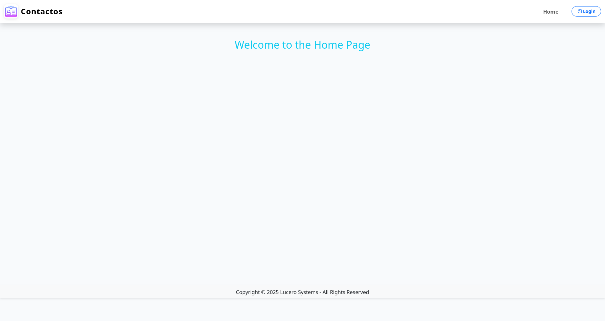 | Public Page |
| 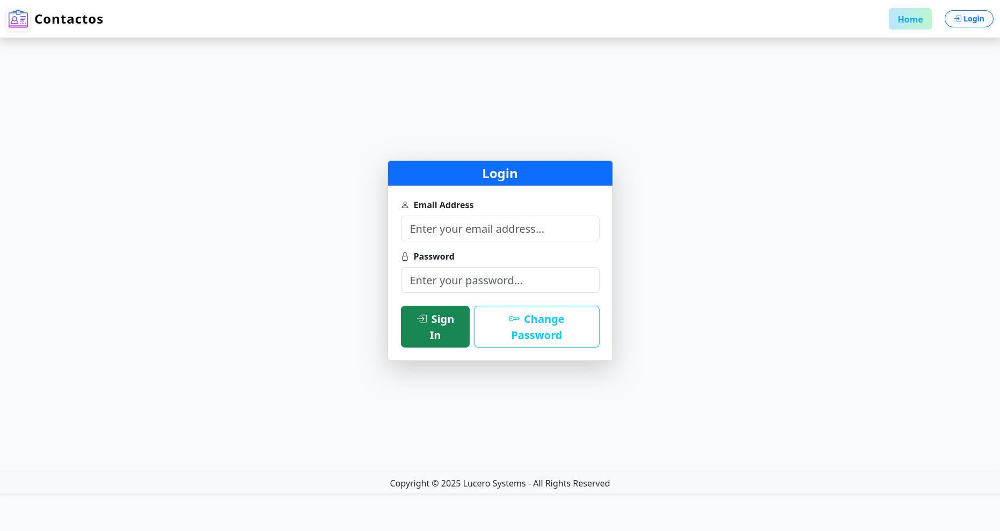 | Login Form |
| 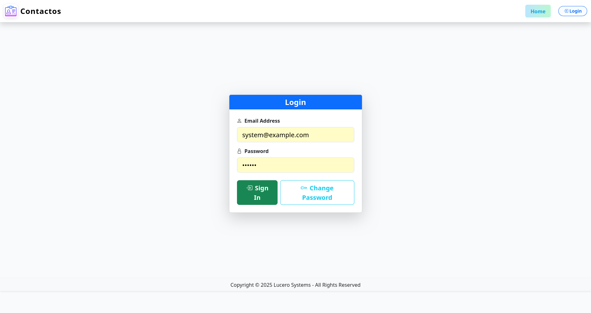 | Login Form |
| 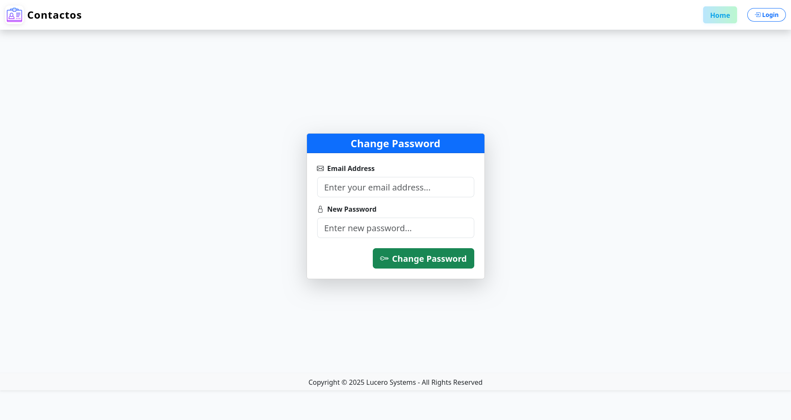 | Change Password Form |
|  | Private Page |
| 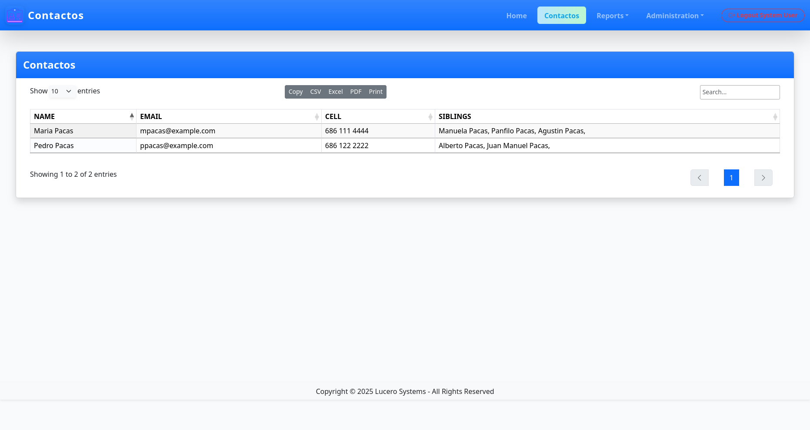 | Contactos Dashboard |
| 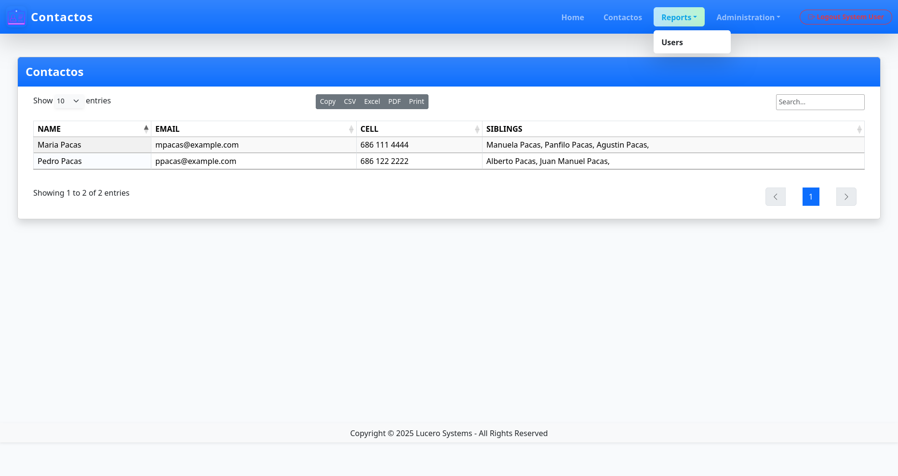 | Reports Menu |
| 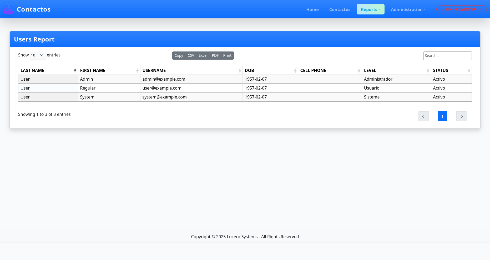 | Users Report |
| 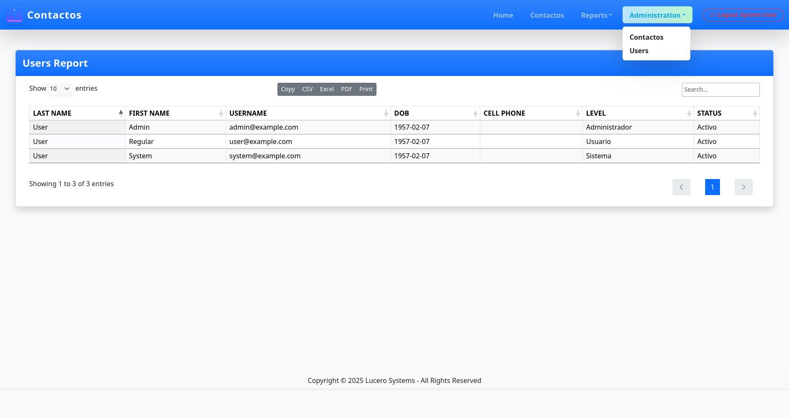 | Administration Menu |
| 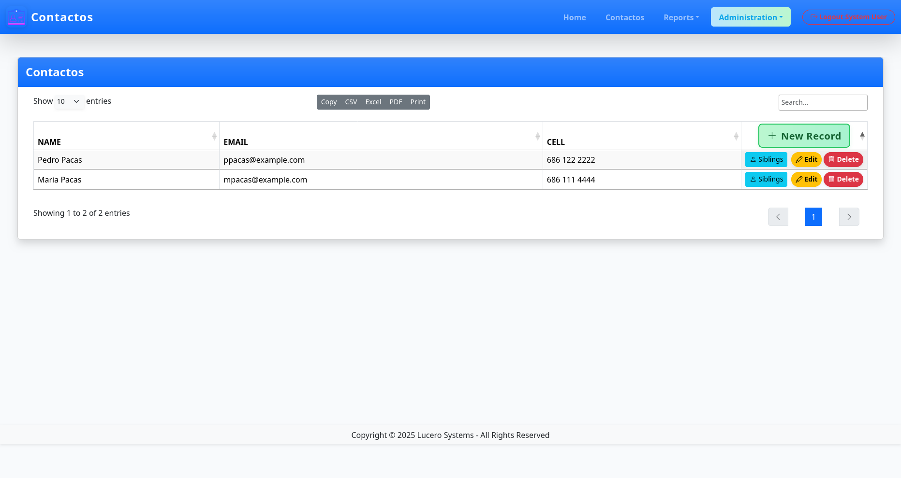 | Contactos Grid |
| 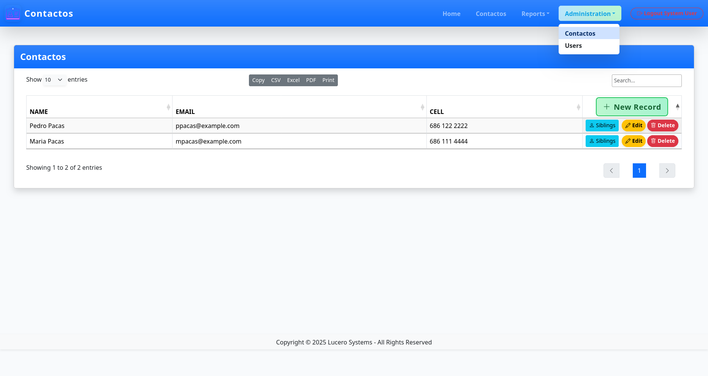 | Administration Menu |
| 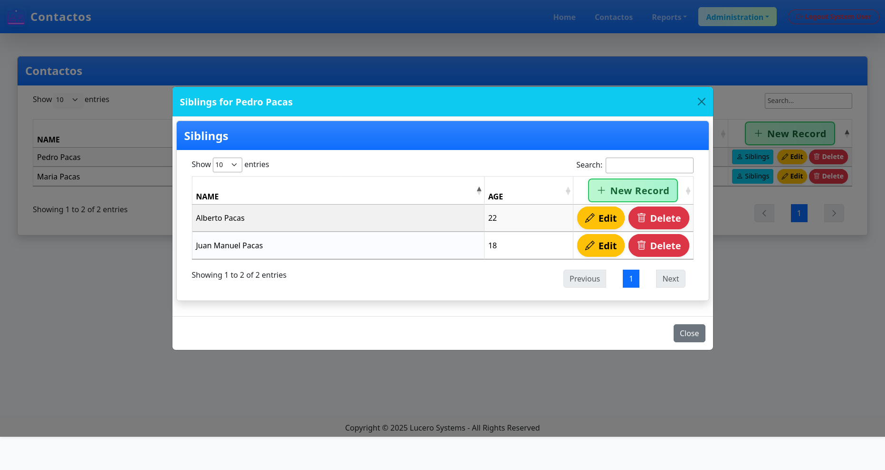 | Siblings Subgrid |
|  | Subgrid Edit Record |
| 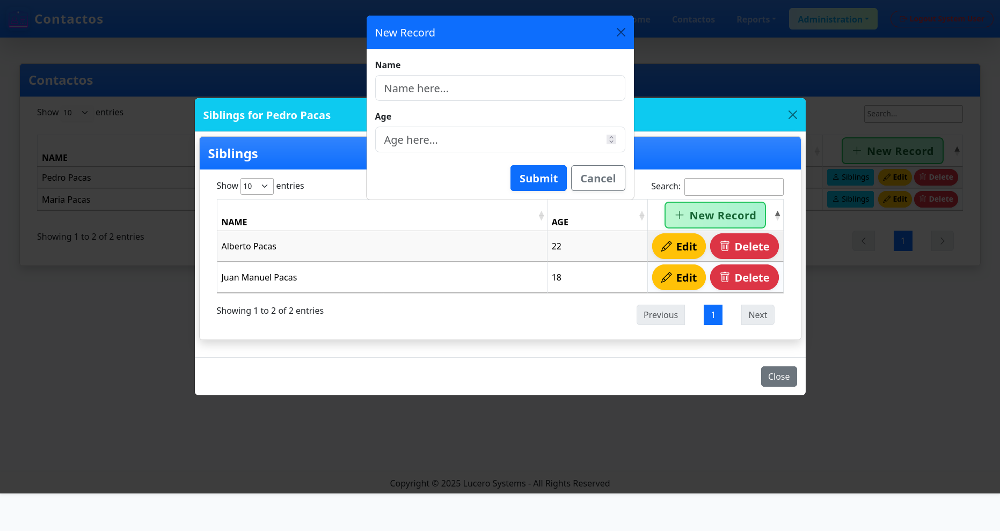 | Subgrid New Record |
| 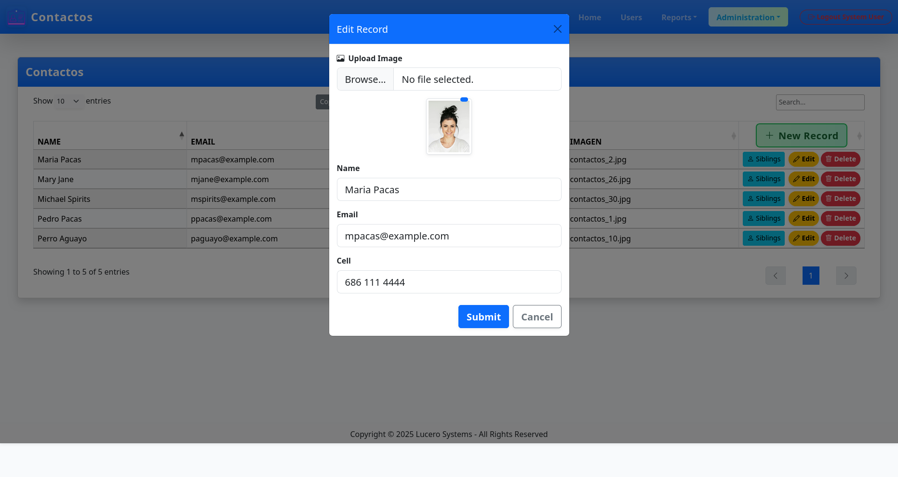 | Grid Edit with thumbnail |
| 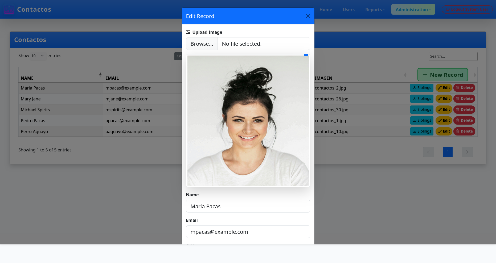 | Grid Edit with image |
| 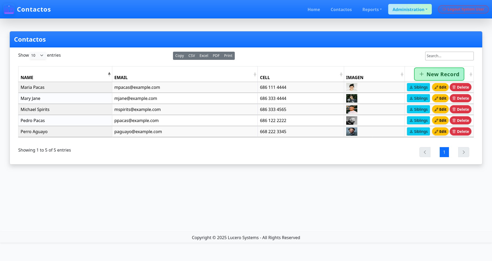 | Grid showing thumbnails |

*All screenshots are from a default LST application using Bootstrap 5 styling. You can fully customize the appearance and layout to match your branding.*

---

## 🎬 Demo

<p align="center">
  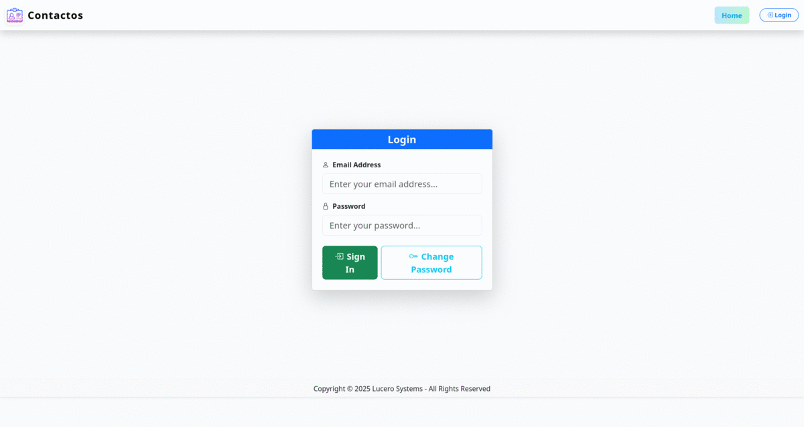
  <br/>
  <sub>See docs/DEMO.md to rebuild this GIF locally from screenshots.</sub>
  <br/>
</p>

## ✨ Features

| Feature | Description | Benefit |
|---------|-------------|---------|
| **Rapid Scaffolding** | Generate complete CRUD in seconds | 🚀 10x faster development |
| **Database Agnostic** | MySQL, PostgreSQL, SQLite support | 🔄 Easy deployment flexibility |
| **Modern UI** | Bootstrap 5 + DataTables | 💎 Professional appearance |
| **Security Built-in** | Role-based access control | 🔒 Enterprise-ready security |
| **Modal Subgrids** | Master-detail relationships | 📊 Rich data relationships |
| **Migration System** | Database versioning | 🔧 Easy schema management |

---

## 🚀 Quick Start

### Prerequisites

| Requirement | Version | Download |
|-------------|---------|----------|
| **Java** | 17+ | [OpenJDK](https://openjdk.org/) |
| **Clojure** | 1.10+ | [Clojure.org](https://clojure.org/) |
| **Leiningen** | 2.9.0+ | [Leiningen.org](https://leiningen.org/) |

### Installation

Create a new app directly from Clojars (no clone needed):

```bash
lein new org.clojars.hector/lst myapp
cd myapp
```

### First Run

```bash
# 1) Configure database (see Configuration section)
# 2) Run migrations and seed data (optional for sample data)
lein migrate
lein database

# 3) Start the development server
lein with-profile dev run
```

🎉 **Success!** Open http://localhost:3000

---

## ⚙️ Configuration

### Database Configuration

Edit `resources/private/config.clj` with your database credentials:

```clojure
{:connections
 { ;; --- Mysql database ---
  :mysql {:db-type   "mysql"                                 ;; "mysql", "postgresql", "sqlite", etc.
         :db-class  "com.mysql.cj.jdbc.Driver"              ;; JDBC driver class
         :db-name   "//localhost:3306/your_dbname"           ;; JDBC subname (host:port/db)
         :db-user   "root"
         :db-pwd    "your_password"}

  ;; --- Local SQLite database ---
  :sqlite {:db-type   "sqlite"
            :db-class  "org.sqlite.JDBC"
            :db-name   "db/your_dbname.sqlite"}                   ;; No user/pwd needed for SQLite

  ;; --- PostgreSQL database ---
  :postgres {:db-type   "postgresql"
       :db-class  "org.postgresql.Driver"
       :db-name   "//localhost:5432/your_dbname"
       :db-user   "root"
       :db-pwd    "your_password"}

  ;; --- Default connection used by the app ---
  :main :postgres ; Used for migrations
  :default :postgres ; Used for generators (lein grid, lein dashboard, etc.)
  :db :mysql
  :pg :postgres
  :localdb :sqlite}

 ;; --- Other global app settings ---
 :uploads      "./uploads/your_upload_folder/"      ;; Path for file uploads
 :site-name    "your_site_name"                 ;; App/site name
 :company-name "your_company_name"            ;; Company name
 :port         3000                        ;; App port
 :tz           "US/Pacific"                ;; Timezone
 :base-url     "http://0.0.0.0:3000/"      ;; Base URL
 :img-url      "https://0.0.0.0/uploads/"  ;; Image base URL
 :path         "/uploads/"                 ;; Uploads path (for web)
 :max-upload-mb 5
 :allowed-image-exts ["jpg" "jpeg" "png" "gif" "bmp" "webp"]
   ;; --- UI Theme ---
   :theme "cerulean" ;; Options: "default" (Bootstrap), "cerulean", "slate", "minty", "lux", "cyborg", "sandstone", "superhero", "flatly", "yeti"
 ;; Optional email config
 :email-host   "smtp.example.com"
 :email-user   "user@example.com"
 :email-pwd    "emailpassword"}
```

> ⚠️ **Important**: Always update `:main` and `:default` to point to your primary database connection. This allows you to run `lein migrate`, `lein grid`, `lein dashboard`, etc. without specifying the database each time. If you only use one database, set both to the same connection key (e.g., `:mysql`, `:postgres`, or `:sqlite`).

### Configuration Sections

| Section | Purpose | Required |
|---------|---------|----------|
| `:connections` | Database connections and defaults | ✅ Yes |
| `:uploads` | File upload directory path | ⚠️ If using file uploads |
| `:site-name` | Application/site name | ⚠️ Recommended |
| `:company-name` | Company name for branding | ⚠️ Recommended |
| `:port` | Application server port | ⚠️ Recommended |
| `:tz` | Application timezone | ⚠️ Recommended |
| `:base-url` | Base URL for the application | ⚠️ Recommended |
| `:img-url` | Base URL for images | ⚠️ If serving images |
| `:path` | Web path for uploads | ⚠️ If using file uploads |
| `:theme` | Default UI theme (see Themes section) | ⚠️ Recommended |
| `:email-*` | SMTP email configuration | ⚠️ If sending emails |

### Database Setup Commands

| Database | Setup Command | Migration Command |
|----------|---------------|-------------------|
| **MySQL** | `CREATE DATABASE mydb CHARACTER SET utf8mb4 COLLATE utf8mb4_unicode_ci;` | `lein migrate db` |
| **PostgreSQL** | `CREATE DATABASE mydb;` | `lein migrate pg` |
| **SQLite** | *Auto-created* | `lein migrate localdb` |

### Default Users

After running `lein database`, these test users are available:

| Email | Password | Role | Access Level |
|-------|----------|------|--------------|
| user@example.com | user | User | Basic access |
| admin@example.com | admin | Admin | Administrative access |
| system@example.com | system | System | Full system access |

---

## 🎨 Themes

LST includes multiple Bootstrap 5 themes and a built‑in theme switcher in the navbar. Set a default theme in `config.clj`, then change it anytime from the dropdown.

### Set the default theme

Edit `resources/private/config.clj` in your generated app and set `:theme` to one of the supported values:

```clojure
;; resources/private/config.clj (excerpt)
{:theme "cerulean" ;; Options: "default" (Bootstrap), "cerulean", "slate", "minty", "lux", "cyborg", "sandstone", "superhero", "flatly", "yeti"
 ;; ...other settings...
}
```

The selected theme is applied via a `theme-<name>` class on `<body>` and corresponding styles are loaded automatically by the layout.

### Switch themes from the navbar

Use the Theme dropdown in the top navbar to switch instantly—no reload required. The default is whatever you set in `:theme`.

### Available themes (previews)

Below are thumbnails of the bundled themes available in this template:

| Theme | Preview |
|-------|---------|
| Default (Bootstrap) | 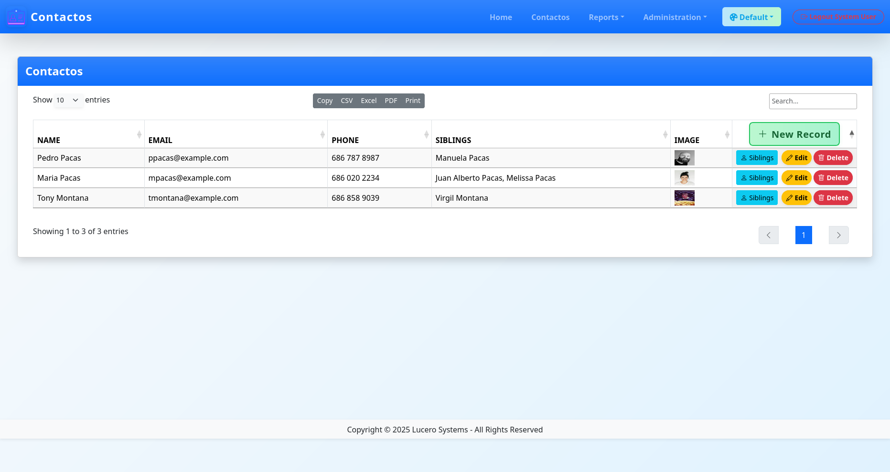 |
| Cerulean | 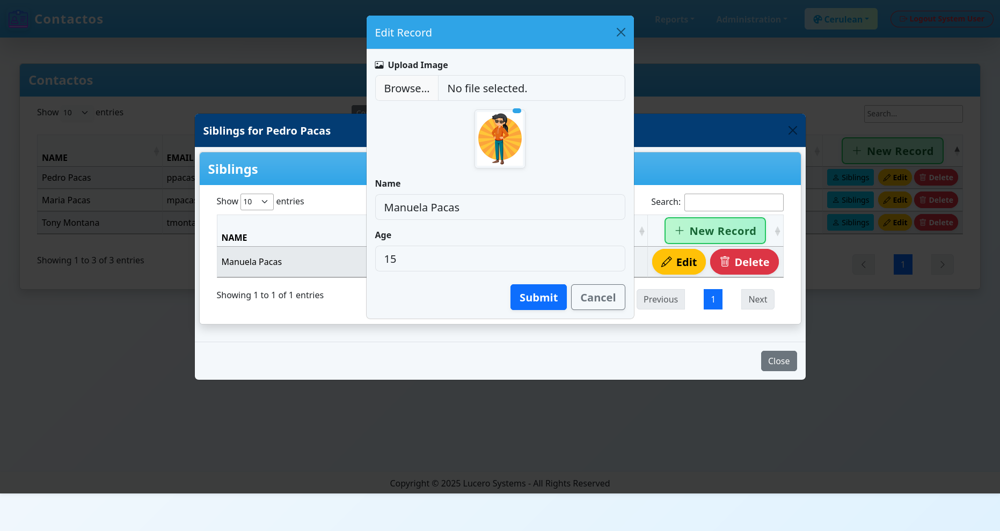 |
| Cyborg | 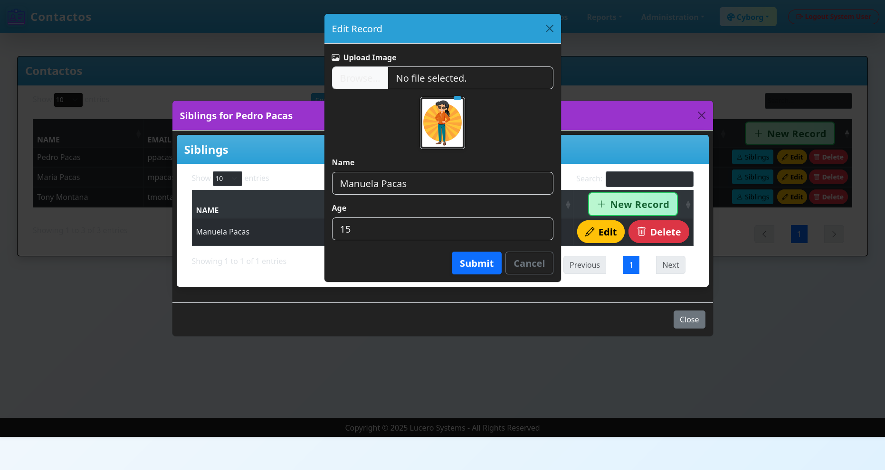 |
| Flatly | 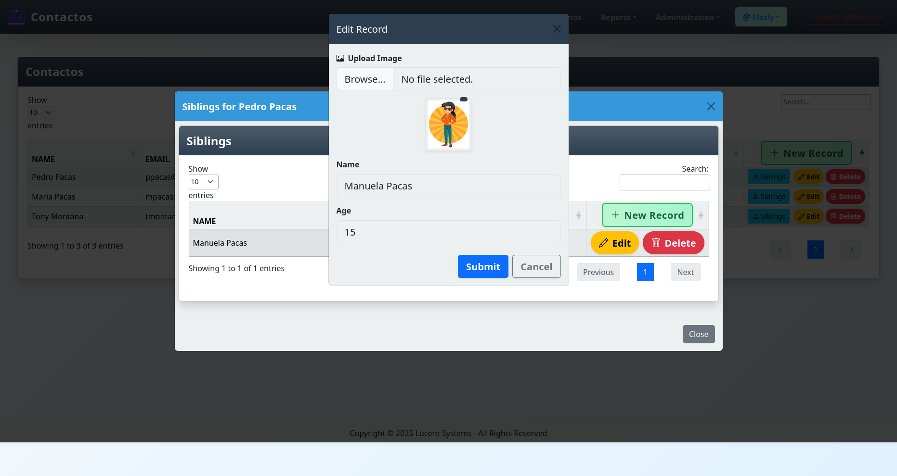 |
| Lux | 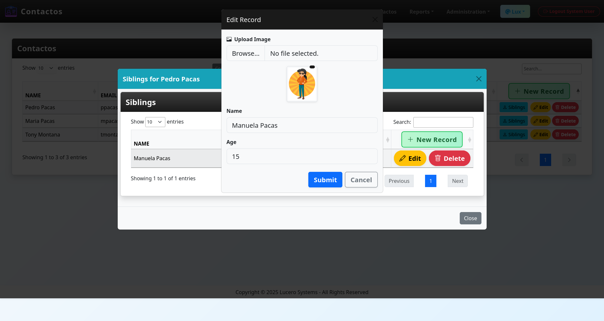 |
| Minty | 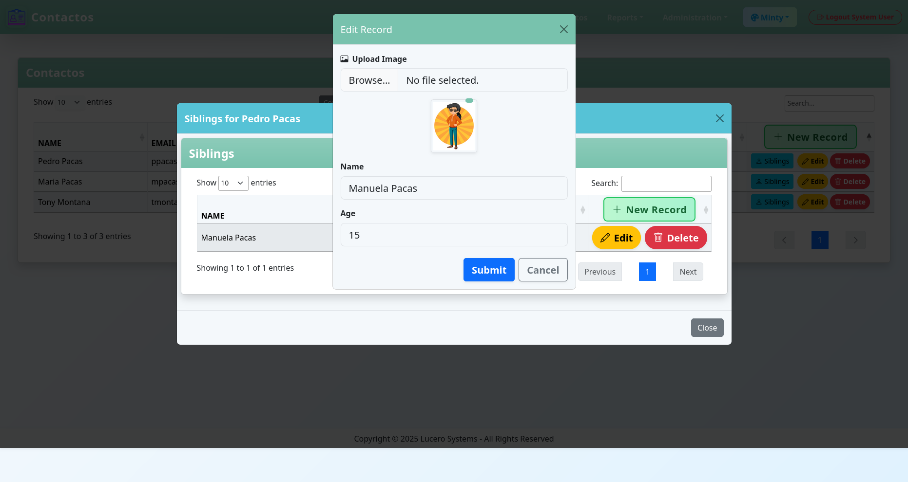 |
| Sandstone | 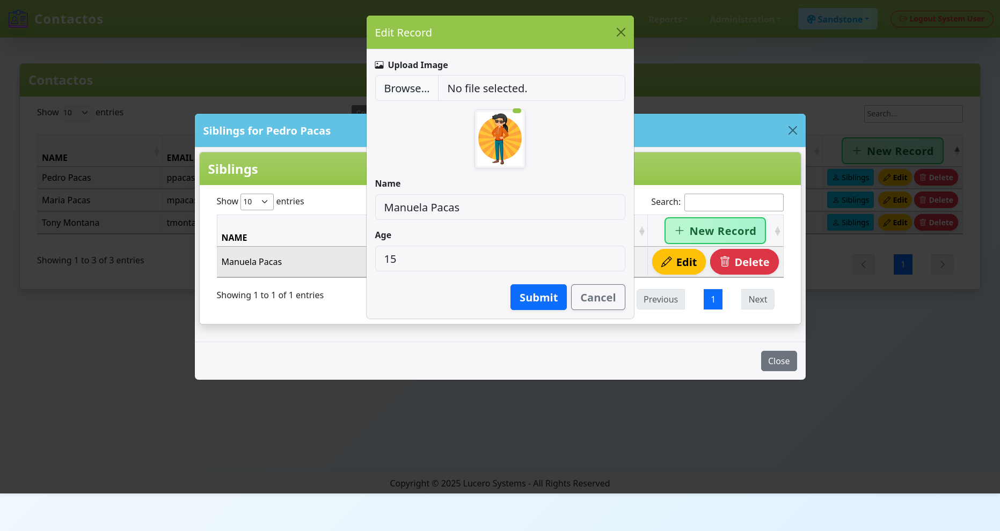 |
| Slate | 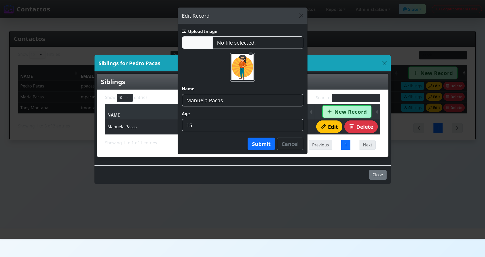 |
| Superhero | 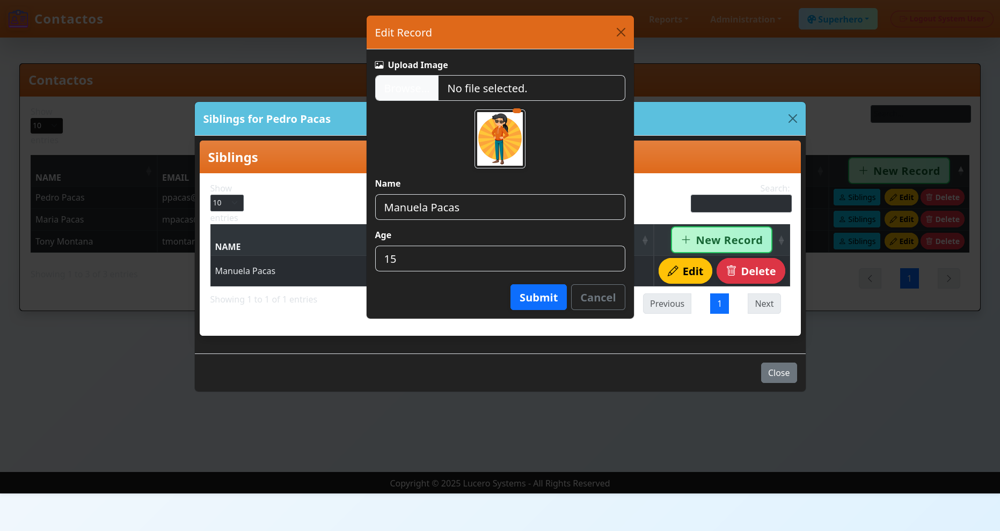 |
| Yeti | 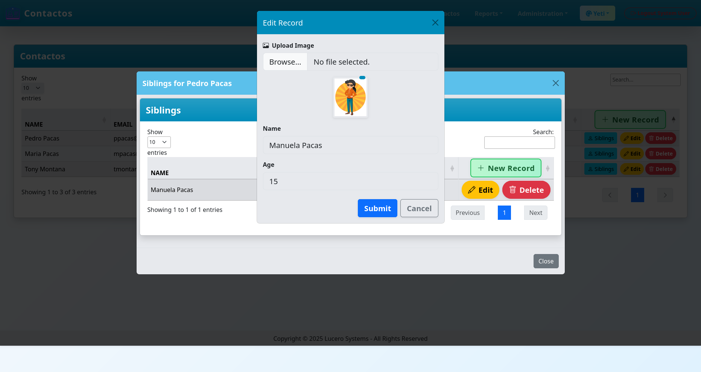 |

Notes:
- If you don’t set `:theme`, the app falls back to `default`.
- The theme switcher control is included by default in the layout’s navbar; no extra setup is needed.

---


## 🧠 Core Concepts

### Architecture Overview

```
myapp/
├── src/myapp/
│   ├── handlers/                # Application logic (MVC controllers)
│   │   ├── admin/               # Admin CRUD interfaces (one folder per table)
│   │   ├── reports/             # Custom report handlers
│   │   └── <table>/             # Dashboard/read-only handlers (one per table)
│   ├── models/                  # Database models and seed data
│   │   └── cdb.clj              # Seed/test data definitions
│   ├── routes/
│   │   ├── proutes.clj          # Private (authenticated) routes
│   │   └── routes.clj           # Public (open) routes
│   ├── layout.clj               # Global page layout and shared UI
│   ├── menu.clj                 # Navigation and sidebar menu definitions
│   └── builder/                 # Generator source templates (advanced customization)
└── resources/
    ├── private/
    │   └── config.clj           # Application and database configuration
    └── migrations/              # Database migration SQL scripts
```

#### Why MVC?

LST uses the Model-View-Controller (MVC) pattern to organize your application into clear, modular components:

- **Model**: Handles data access and business logic.
- **View**: Renders the user interface.
- **Controller**: Orchestrates requests, responses, and user actions.

Each grid, dashboard, or report generated by LST gets its own controller, model, and view.  
**This modular approach allows you to:**
- Easily plug any generated grid or feature into any LST-based web app.
- Maintain and extend features independently, without affecting others.
- Assign different database connections to different grids or modules, giving you the flexibility to run parts of your app on different databases while keeping everything integrated.

This structure ensures a clear separation of concerns, making your application scalable, maintainable, and highly flexible for future growth.

---

## 🔧 Generator Commands

### Grid Generator (CRUD)

**Purpose**: Creates full Create, Read, Update, Delete interfaces

By default, all fields are inferred from the database schema.  
**Specifying fields is optional**—only use it to customize labels or limit fields.

```bash
# Basic usage (all fields auto-detected)
lein grid users

# With database connection
lein grid pg customers

# With access restrictions
lein grid orders :rights [A S]

# (Optional) Specify fields and labels
lein grid products "Product Name:name" "Price:price" "Category:category_id"
```

**Generated Files**:
- `src/myapp/handlers/admin/<table>/controller.clj`
- `src/myapp/handlers/admin/<table>/model.clj`
- `src/myapp/handlers/admin/<table>/view.clj`

---

### Dashboard Generator (Read-Only)

**Purpose**: Creates read-only data tables

By default, all fields are inferred from the database schema.  
**Specifying fields is optional**.

```bash
# Basic usage (all fields auto-detected)
lein dashboard products

# With access restrictions
lein dashboard users :rights [S]

# (Optional) Specify fields and labels
lein dashboard users "Name:firstname" "Email:email" "Joined:created_at"
```

**Generated Files**:
- `src/myapp/handlers/<table>/controller.clj`
- `src/myapp/handlers/<table>/model.clj`
- `src/myapp/handlers/<table>/view.clj`

---

### Report Generator

**Purpose**: Creates custom report pages

By default, all fields are inferred from the database schema.  
**Specifying fields is optional**.

```bash
# Basic usage (all fields auto-detected)
lein report monthlySales

# With access restrictions
lein report userActivity :rights [A S]

# With database connection
lein report pg inventoryReport :set-default
```

**Generated Files**:
- `src/myapp/handlers/reports/<name>/controller.clj`
- `src/myapp/handlers/reports/<name>/model.clj`
- `src/myapp/handlers/reports/<name>/view.clj`

---

### Subgrid Generator (Master-Detail)

**Purpose**: Creates child grids linked to parent records

By default, all fields are inferred from the database schema.  
**Specifying fields is optional**.

```bash
# Basic usage (all fields auto-detected)
lein subgrid order_items orders order_id

# With access restrictions
lein subgrid user_addresses users user_id :rights [A]

# (Optional) Specify fields and labels
lein subgrid order_items orders order_id "Product:product_name" "Qty:quantity"
```

**Requirements**:
- Parent table must have primary key `id`
- Child table must have foreign key to parent
- Child table must have primary key `id`

#### Example Subgrid UI

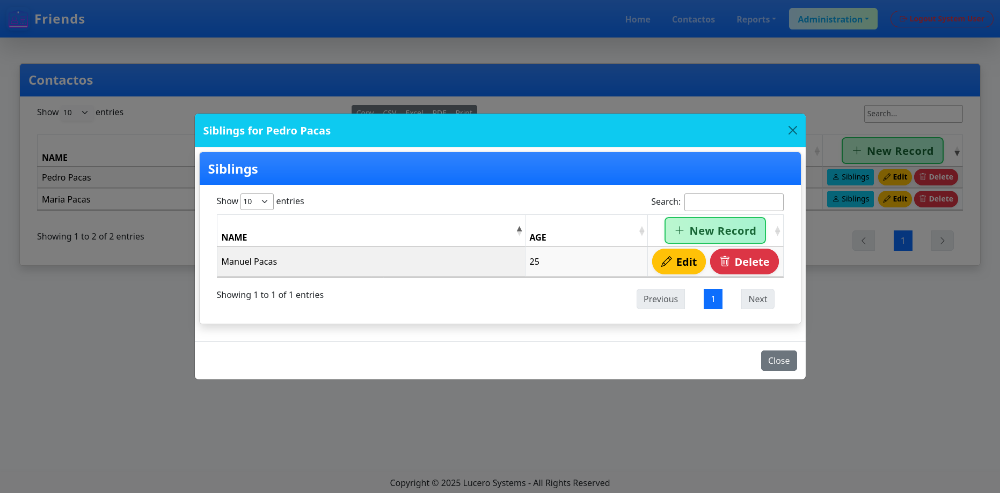
*Example: A subgrid showing sibling items within an contactos.*

---

## 🗄️ Database Support

### Supported Databases

| Database | Driver | Connection Key | Production Ready |
|----------|--------|----------------|------------------|
| **MySQL** | `com.mysql.cj.jdbc.Driver` | `db` | ✅ Yes |
| **PostgreSQL** | `org.postgresql.Driver` | `pg` | ✅ Yes |
| **SQLite** | `org.sqlite.JDBC` | `localdb` | ⚠️ Development |

### Migration Commands

| Command | Purpose | Example |
|---------|---------|---------|
| `lein migrate [conn]` | Run pending migrations | `lein migrate pg` |
| `lein rollback [conn]` | Rollback last migration | `lein rollback` |
| `lein database [conn]` | Seed test data | `lein database localdb` |

### Migration Files

Migrations are database-specific and located in `resources/migrations/`:

```
resources/migrations/
├── 001-initial.mysql.up.sql
├── 001-initial.postgresql.up.sql
├── 001-initial.sqlite.up.sql
├── 002-users.mysql.up.sql
└── ...
```

#### Parent/Child example migrations (quick copy)

Each code block should be copied into a file with the name shown above it.

##### PostgreSQL

001-parent.postgresql.down.sql
```sql
DROP TABLE IF EXISTS parent;
```

001-parent.postgresql.up.sql
```sql
CREATE TABLE IF NOT EXISTS parent (
  id SERIAL PRIMARY KEY,
  name TEXT,
  created_on DATE,
  created_at TIMESTAMPTZ DEFAULT NOW(),
  event_time TIME,
  is_active BOOLEAN DEFAULT FALSE,
  amount NUMERIC(10,2),
  note TEXT
);
```

002-child.postgresql.down.sql
```sql
DROP TABLE IF EXISTS child;
```

002-child.postgresql.up.sql
```sql
CREATE TABLE IF NOT EXISTS child (
  id SERIAL PRIMARY KEY,
  parent_id INTEGER,
  name TEXT,
  created_on DATE,
  created_at TIMESTAMPTZ DEFAULT NOW(),
  event_time TIME,
  is_active BOOLEAN DEFAULT FALSE,
  amount NUMERIC(10,2),
  note TEXT,
  FOREIGN KEY (parent_id) REFERENCES parent(id)
);
```

001-parent.mysql.down.sql
```sql
DROP TABLE IF EXISTS parent;
```

001-parent.mysql.up.sql
```sql
CREATE TABLE IF NOT EXISTS parent (
  id INT AUTO_INCREMENT PRIMARY KEY,
  name VARCHAR(100),
  created_on DATE,
  created_at TIMESTAMP DEFAULT CURRENT_TIMESTAMP,
  event_time TIME,
  is_active BOOLEAN DEFAULT FALSE,
  amount DECIMAL(10,2),
  note TEXT
)
ENGINE=InnoDB;
```

002-child.mysql.down.sql
```sql
DROP TABLE IF EXISTS child;
```

002-child.mysql.up.sql
```sql
CREATE TABLE IF NOT EXISTS child (
  id INT AUTO_INCREMENT PRIMARY KEY,
  parent_id INT,
  name VARCHAR(100),
  created_on DATE,
  created_at TIMESTAMP DEFAULT CURRENT_TIMESTAMP,
  event_time TIME,
  is_active BOOLEAN DEFAULT FALSE,
  amount DECIMAL(10,2),
  note TEXT,
  FOREIGN KEY (parent_id) REFERENCES parent(id)
)
ENGINE=InnoDB;
```

##### SQLite

001-parent.sqlite.down.sql
```sql
DROP TABLE IF EXISTS parent;
```

001-parent.sqlite.up.sql
```sql
CREATE TABLE IF NOT EXISTS parent (
  id INTEGER PRIMARY KEY AUTOINCREMENT,
  name TEXT,
  created_on TEXT,
  created_at TEXT DEFAULT (datetime('now')),
  event_time TEXT,
  is_active INTEGER DEFAULT 0,
  amount NUMERIC(10,2),
  note TEXT
);
```

002-child.sqlite.down.sql
```sql
DROP TABLE IF EXISTS child;
```

002-child.sqlite.up.sql
```sql
CREATE TABLE IF NOT EXISTS child (
  id INTEGER PRIMARY KEY AUTOINCREMENT,
  parent_id INTEGER,
  name TEXT,
  created_on TEXT,
  created_at TEXT DEFAULT (datetime('now')),
  event_time TEXT,
  is_active INTEGER DEFAULT 0,
  amount NUMERIC(10,2),
  note TEXT,
  FOREIGN KEY (parent_id) REFERENCES parent(id)
);
```

---

## 🧪 Testing

LST includes a focused test suite to validate routing helpers and database vendor abstractions. Tests are generated with every new app and run with the standard Leiningen workflow.

### What’s covered

- `core_test.clj` (namespace: `myapp.core-test`)
  - Verifies Compojure resource/file route helpers return valid Ring handlers.
- `db_test.clj` (namespace: `myapp.db-test`)
  - Time projection formatting per vendor (MySQL/PostgreSQL/SQLite).
  - Query options by vendor (entity quoting, etc.).
  - SQLite table description mapping to a common describe format.
  - Primary key detection across vendors.
  - Cascading deletion of child images (SQLite path), using query stubs.
- `db_vendor_test.clj` (namespace: `myapp.db-vendor-test`)
  - Vendor-specific describe-table execution semantics (MySQL/PostgreSQL).
  - `last-insert-id` behavior (MySQL/SQLite implemented, PostgreSQL returns `nil`).
  - Cascading deletion of child images for MySQL and PostgreSQL paths.

All tests use in-memory stubs and do not require a live database connection.

### Run tests (generated app)

From your generated app directory (e.g., `myapp/`):

```bash
# Run all tests
lein test

# Run a specific namespace
lein test myapp.core-test
lein test myapp.db-test
lein test myapp.db-vendor-test

# Run a single test var
lein test :only myapp.db-test/time-projection-test
lein test :only myapp.db-vendor-test/last-insert-id-tests
```

Notes:
- Replace `myapp` with your application’s actual namespace root.
- These tests mock JDBC calls and vendor queries, so they don’t rely on your `resources/private/config.clj` settings.

### Run tests (template contributors)

Because this repository is a Leiningen template, the test sources live under the template path and are materialized into a generated project. To exercise them:

```bash
# 1) Install the template locally
lein clean && lein deps && lein install

# 2) Generate a fresh app from the template
lein new lst myapp
cd myapp

# 3) Run the test suite
lein test
```

Optional tips:
- Run with profiles explicitly if needed: `lein with-profile test test`.
- For more verbose output, re-run failing namespaces individually as shown above.

---


## 🔐 Access Control

### Setting Access Rights

```bash
# Admin and System only
lein grid sensitive_data "Data:value" :rights [A S]

# System only
lein dashboard system_logs "Time:timestamp" "Message:message" :rights [S]

# All authenticated users (default)
lein dashboard public_info "Title:title" "Content:content"
```

### Implementation

Generated controllers automatically check user permissions:

```clojure
(defn handler [request]
  (if (auth/has-rights? (:session request) [:A :S])
    (render-page request)
    (response/redirect "/unauthorized")))
```

---

## 🔗 Integrating Subgrids

### Manual Integration Example

After generating a subgrid, integrate it into the parent view:

```clojure
(ns myapp.handlers.admin.users.view
  (:require [myapp.models.grid :refer [build-grid-with-subgrids create-subgrid-config]]))

(defn users-view [title rows]
  (let [labels ["Name" "Email"]
        db-fields [:firstname :email]
        fields (apply array-map (interleave db-fields labels))
        table-id "users_table"
        href "/admin/users"
        args {:new true :edit true :delete true
              :subgrids [{:title "User Contacts"
                          :table-name "user_contacts"
                          :foreign-key "user_id"
                          :href "/admin/usercontactsusers"
                          :icon "bi bi-people"
                          :label "Contacts"}]}]
    (build-grid-with-subgrids title rows table-id fields href args)))
```

---

## 🗂️ Project File Map

A quick reference for where to find and update everything in your generated LST app.

| Feature/Area      | Location(s)                                                                 | Purpose / What to Edit                                  |
|-------------------|-----------------------------------------------------------------------------|---------------------------------------------------------|
| **CRUD Grids**    | `src/myapp/handlers/admin/<table>/`                                         | Controllers, models, and views for admin CRUD           |
| **Dashboards**    | `src/myapp/handlers/<table>/`                                               | Read-only table controllers, models, and views          |
| **Reports**       | `src/myapp/handlers/reports/<name>/`                                        | Custom report controllers, models, and views            |
| **Subgrids**      | `src/myapp/handlers/admin/<child>/`<br>`src/myapp/handlers/admin/<parent>/` | Child grid logic and parent integration                 |
| **Menus**         | `src/myapp/menu.clj`                                                        | Update navigation and sidebar links                     |
| **App Layout**    | `src/myapp/layout.clj`                                                      | Change global page layout and shared UI                 |
| **Routing**       | `src/myapp/routes/`                                                         | URL routing for all features                            |
| **Config**        | `resources/private/config.clj`                                              | Database and global app settings                        |
| **Seed Data**     | `src/myapp/models/cdb.clj`                                                  | Add/edit initial data for `lein database`               |
| **Migrations**    | `resources/migrations/`                                                     | SQL files for schema changes                            |
| **Builder Templates** | `src/myapp/builder/`                                                    | Source templates for code generators (advanced)         |

### 🔎 Quick Tips

- **Add a new menu item?** Edit `src/myapp/menu.clj`.
- **Change database config?** Edit `resources/private/config.clj`.
- **Seed or update test data?** Edit `src/myapp/models/cdb.clj`.
- **Customize generated UI?** Edit files in the relevant handler directory.
- **Change how generators scaffold code?** Advanced: edit builder templates in `src/myapp/builder/`.

---


## 🖼️ Adding Images to Grid Forms

LST makes it easy to display images in your grid forms. To add an image field to a grid or form view, simply use the `build-image-field` utility.

### How to Use

1. **Require the function in your view namespace:**

  ```clojure
  (require '[yourapp.models.form :refer [build-image-field]])
  ```
  Replace `yourapp.models.form` with the appropriate namespace for your grid.

2. **Call `build-image-field` in your view:**

  ```clojure
  (build-image-field row)
  ```
  Here, `row` is the map representing the current record. This will render the image field in your grid or form.

**Example integration in a view:**

```clojure
(defn user-view [row]
  [:div
  [:h3 (:name row)]
  (build-image-field row)])
```

This approach works for any grid or form where you want to display an image associated with a record.

---
## 📝 Building Forms

LST provides a powerful form builder (`form.clj`) that lets you create professional, accessible forms using all standard HTML5 field types. Each field is rendered with Bootstrap 5 styling and supports HTML5 validation, accessibility, and modern browser features.

### How It Works

- Use the `build-field` function to define each form field.
- Pass a Clojure map describing the field’s label, type, name, and any HTML5 attributes you need.
- All standard HTML5 input types are supported: `text`, `email`, `password`, `number`, `date`, `datetime-local`, `month`, `week`, `time`, `color`, `range`, `file`, `tel`, `url`, `search`, `hidden`, `select`, `radio`, `checkbox`, and `textarea`.
- Advanced attributes like `required`, `pattern`, `min`, `max`, `step`, `autocomplete`, `autofocus`, `readonly`, `disabled`, `maxlength`, `minlength`, and more are fully supported.

> Reference: The default form view template is defined in `src/myapp/builder/view.clj` and is used by all generated grids, dashboards, and reports. You can customize this template for advanced layouts or branding.

### Example: Building a Form

```clojure
(form "/submit"
  [(build-field {:label "Full Name" :type "text" :id "name" :name "name" :placeholder "Enter name" :required true :maxlength 50})
   (build-field {:label "Email" :type "email" :id "email" :name "email" :placeholder "Enter email" :required true :autocomplete "email"})
   (build-field {:label "Password" :type "password" :id "pw" :name "pw" :placeholder "Password" :required true :minlength 8})
   (build-field {:label "Birthday" :type "date" :id "bday" :name "bday"})
   (build-field {:label "User Level" :type "select" :id "level" :name "level" :value "U" :required true
                 :options [{:value "" :label "Select..."}
                           {:value "U" :label "User"}
                           {:value "A" :label "Admin"}
                           {:value "S" :label "Sys"}]})]
  (list (build-primary-input-button {:type "submit" :value "Submit"})
        (build-secondary-input-button {:type "button" :value "Cancel"}))
  "Example Form")
```

### Supported Field Types

| Type             | Description                       | Example Attribute(s)           |
|------------------|-----------------------------------|-------------------------------|
| `text`           | Single-line text                  | `:maxlength`, `:pattern`      |
| `email`          | Email address                     | `:autocomplete "email"`       |
| `password`       | Password input                    | `:minlength`, `:autocomplete` |
| `number`         | Numeric input                     | `:min`, `:max`, `:step`       |
| `date`           | Date picker                       |                               |
| `datetime-local` | Local date and time               |                               |
| `month`          | Month picker                      |                               |
| `week`           | Week picker                       |                               |
| `time`           | Time picker                       |                               |
| `color`          | Color picker                      |                               |
| `range`          | Slider input                      | `:min`, `:max`, `:step`       |
| `file`           | File upload                       | `:accept`, `:multiple`        |
| `tel`            | Telephone number                  | `:pattern`                    |
| `url`            | URL input                         |                               |
| `search`         | Search box                        |                               |
| `hidden`         | Hidden field                      |                               |
| `select`         | Dropdown/select                   | `:options`                    |
| `radio`          | Radio buttons                     | `:options`                    |
| `checkbox`       | Checkbox group                    | `:options`                    |
| `textarea`       | Multi-line text                   | `:rows`, `:maxlength`         |

---

### 🛠️ Utility Functions for Dynamic Forms (`util.clj`)

The `src/myapp/models/util.clj` file provides many helper functions to make building forms easier and more dynamic.

#### Building Select Field Options with `get-options`

The `(get-options ...)` function lets you dynamically generate options for `<select>`, radio, or checkbox fields directly from your database.

**Signature:**
```clojure
(get-options table value-field label-fields & {:keys [sort-by filter-field filter-value]})
```

**Parameters:**
- `table`: Table name (string)
- `value-field`: Field to use as the option value (string)
- `label-fields`: Field(s) to use as the option label (string or vector of strings)
- `:sort-by`: (optional) Field(s) to sort by
- `:filter-field` / `:filter-value`: (optional) Filter options by field/value

**Example:**
```clojure
;; Get user options for a select field, showing "firstname lastname"
(get-options "users" "id" ["firstname" "lastname"] :sort-by "lastname")
;; => ({:value 1 :label "Alice Smith"} {:value 2 :label "Bob Jones"} ...)

;; Use in a form field:
(build-field {:label "User" :type "select" :name "user_id"
              :options (get-options "users" "id" ["firstname" "lastname"] :sort-by "lastname")})
```

#### Other Useful Utilities

- `year-options`, `month-options`: Generate year/month options from a table's date field.
- `foreign-key`: Fetch a label from a related table for display.
- `not-empty-str`, `parse-int`, `parse-float`, `parse-bool`: Data cleaning and parsing helpers.
- `slugify`: Create URL-friendly slugs from strings.

See `src/myapp/models/util.clj` for more details and examples.

---

## 🐛 Troubleshooting

### Common Issues

| Problem | Cause | Solution |
|---------|-------|----------|
| **Generated components not showing** | Server needs to reload routes | Open `src/myapp/core.clj`, save it (no changes needed), then refresh webpage |
| **Routes not updating** | Server cache | Restart dev server with `lein with-profile dev run` |
| **Database connection error** | Wrong credentials | Check `resources/private/config.clj` |
| **Subgrid not opening** | Missing foreign key | Verify FK exists in child table |
| **Permission denied** | Wrong user role | Check `:rights` setting in generator |
| **Migration failed** | SQL syntax error | Check database-specific SQL files |

### Debug Commands

```bash
# Check database connection
lein repl
=> (require '[myapp.db :as db])
=> (db/test-connection :db)

# Verify routes
=> (require '[myapp.routes.proutes :as routes])
=> (routes/app-routes)

# Test authentication
=> (require '[myapp.auth :as auth])
=> (auth/has-rights? {:user {:role "A"}} [:A :S])
```

---

## 📚 API Reference

### Quick Command Reference

#### Grid Commands
```bash
lein grid <table> "Label:field" ...                    # Basic CRUD
lein grid pg <table> "Label:field" ... :set-default    # PostgreSQL + save default
lein grid <table> "Label:field" ... :rights [A S]      # Restricted access
```

#### Dashboard Commands
```bash
lein dashboard <table> "Label:field" ...               # Read-only table
lein dashboard <table> "Label:field" ... :rights [S]   # System access only
```

#### Report Commands
```bash
lein report <name>                                      # Basic report
lein report <name> :rights [A S]                       # Admin/System only
```

#### Subgrid Commands
```bash
lein subgrid <child> <parent> <fk> "Label:field" ...   # Master-detail
lein subgrid <child> <parent> <fk> :rights [A]         # Admin only
```

### Database Operations

| Command | Description |
|---------|-------------|
| `lein migrate [conn]` | Apply pending migrations |
| `lein rollback [conn]` | Rollback last migration |
| `lein database [conn]` | Seed test data |

### Connection Keys

| Key | Database | Usage |
|-----|----------|-------|
| `db` | MySQL | Default production |
| `pg` | PostgreSQL | Alternative production |
| `localdb` | SQLite | Development/testing |

---

## 🤝 Contributing

Developing the template locally?

```bash
git clone <your-fork-or-this-repo>
cd lst
lein clean && lein deps && lein install
lein new lst myapp
cd myapp && lein test
```

Then open a PR with your changes.

---

## 📄 License

This project is licensed under the MIT License - see the LICENSE file for details.

---

## 📦 Releases

Publish a release to improve discoverability and trust (enables the Latest Release badge):

```bash
# Tag and push your first release
git tag v0.1.0
git push origin v0.1.0
```

This triggers the “Release on tag” workflow which creates a GitHub Release with auto-generated notes.

---

## 🧾 Changelog

See all release notes at https://github.com/hectorqlucero/lst/releases

---

## 🔗 Resources

- [Leiningen Documentation](https://leiningen.org/)
- [Clojure Documentation](https://clojure.org/)
- [Bootstrap 5 Documentation](https://getbootstrap.com/docs/5.0/)
- [DataTables Documentation](https://datatables.net/)

---

*Generated with ❤️ by LST - Lucero Systems Template*